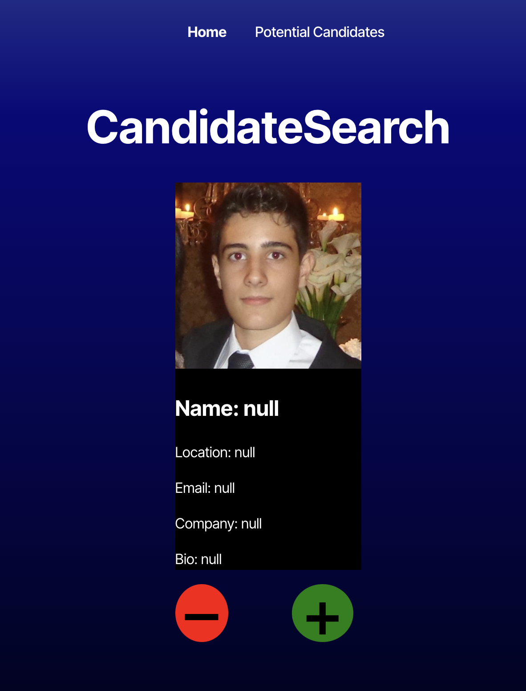

# gitAPI

## Table of Contents

- [Description](#description)
- [Installation](#installation)
- [Usage](#usage)
- [Credits](#credits)
- [License](#license)
- [Badge](#badge)
- [Features](#features)
- [Contribute](#contribute)
- [Tests](#tests)
- [Questions](#questions)

## Description

gitAPI is a **React-based candidate search application** that uses the GitHub API to fetch and display candidate information. This project helps employers to quickly review candidate profiles, save potential hires for further consideration, and manage their candidate list. Built with **React** and **Vite**, to provide a user-friendly interface and persistent data storage via localStorage. https://gitapi-1.onrender.com/

Deployed Website:

## Installation

Clone this repository to your local machine: git@github.com:logles/gitAPI.git

## Usage

- Open the application in your browser after running npm run dev.
- The Candidate Search page displays a candidate's GitHub profile details such as their name, location, email, company, and bio.
- Click the "+" button to save the current candidate to your list of potential hires and automatically load the next candidate.
- Click the "– button" to skip the current candidate without saving and load the next candidate.
- Visit the Potential Candidates page to view your saved candidates in a table format. Each row displays the candidate's avatar, name, location, email, company, and bio, along with a Reject button to remove them from the list.

## Credits

- GitHub API for providing candidate data.
- Xpert Learning Assistant Chat+
- Bootcamp TAs
- Family Tutors

## License

This project is licensed under the **MIT License**.

[License Link](https://opensource.org/licenses/MIT)

## Badge

## Features

- React-based candidate search application integrating with the GitHub API.
- Dynamic candidate fetching with detailed profile information.
- Save and manage potential candidates using localStorage.
- User-friendly interface with a clean, responsive design.
- Candidate management table for easy review and removal of saved candidates

## How to Contribute

Contributions are welcome! Open a Pull Request.

## Tests

n/a

## Questions

For any questions, feel free to reach out:

- GitHub: https://github.com/logles
